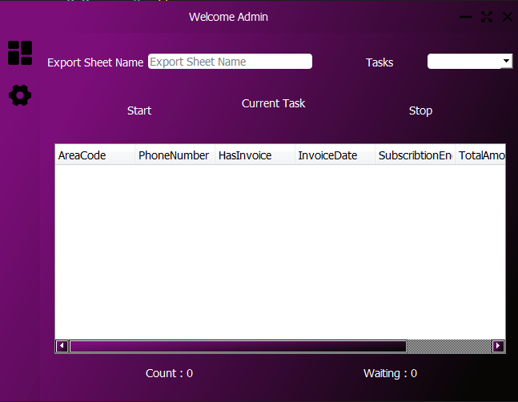
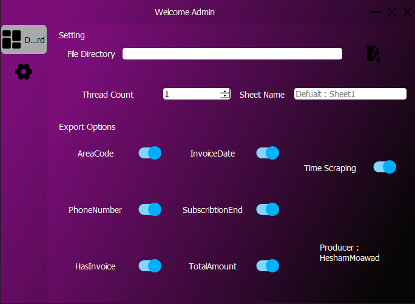

# WePayInvoiceExtractors
WePayInvoiceExtractors simple App to check if Account Has Unpaid Invoices and collect all invoices and Customers Info
Searching By (AreaCode , PhoneNumber)

# Features 

* Add SuperFast Mode ' Control of Threads That you want to Work with ' Max(30 Thread)
* App Saving Waiting Number if you stopped it to clear waiting (Ctrl + r )
* Full Control to Exports Options (Not Export Column if Disabled)
* Easly to add EXCEL File 
* Handling Sheet Name That You Want to Use (Write Sheet Name that Contain Data if Not "Sheet1")
* Searching for unlimited Phones 

## Pages

* DashBoard --> To Start Tasks and Export Results 
* Setting --> To Manage Threads and Export Options

## Built With Package

* Selenium 
* PyQt5
* Json
* Openpyxl
* Pandas
* Datetime
* ProxyFilterAPI (My Package)
* Pyperclip

# ScreenShots
 

 

## Frameworks 
* [PyQt5](https://doc.qt.io/qtforpython/)   For Build GUI 
* [Selenium](https://www.selenium.dev/)     For WebAutomation 
* [Pandas](https://pandas.pydata.org/) For Make Data Operations
* [Json](https://www.json.org/json-en.html) For Handling Server Request and Response

## Contact 

* Gmail : HeshamMoawad120120@gmail.com
* WhatsApp : +201111141853

## Made By K7_Team Hesham